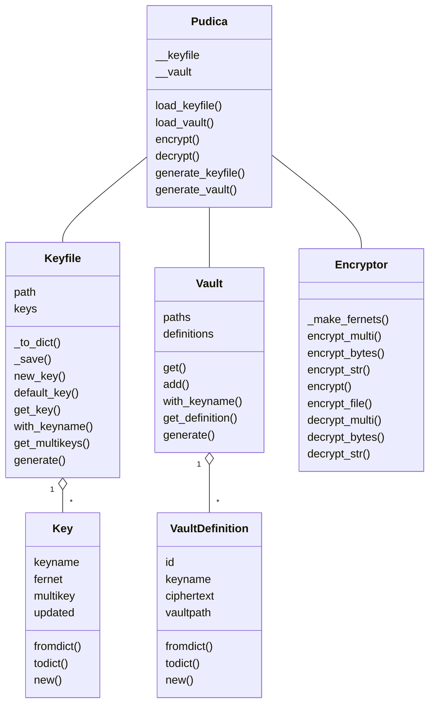

```mermaid
classDiagram
      class Keyfile{
        path
        keys
        _to_dict()
        _save()
        new_key()
        default_key()
        get_key()
        with_keyname()
        get_multikeys()
        generate()
      }
      class Vault{
        paths
        definitions
        get()
        add()
        with_keyname()
        get_definition()
        generate()
      }
      class Encryptor{
        _make_fernets()
        encrypt_multi()
        encrypt_bytes()
        encrypt_str()
        encrypt()
        encrypt_file()
        decrypt_multi()
        decrypt_bytes()
        decrypt_str()
      }
      class Pudica{
        __keyfile
        __vault
        load_keyfile()
        load_vault()
        encrypt()
        decrypt()
        generate_keyfile()
        generate_vault()
      }
      class VaultDefinition{
        id
        keyname
        ciphertext
        vaultpath
        fromdict()
        todict()
        new()
      }
      class Key{
        keyname
        fernet
        multikey
        updated
        fromdict()
        todict()
        new()
      }
      Keyfile "1" o-- "*" Key
      Vault "1" o-- "*" VaultDefinition
      Pudica -- Keyfile
      Pudica -- Encryptor
      Pudica -- Vault
```