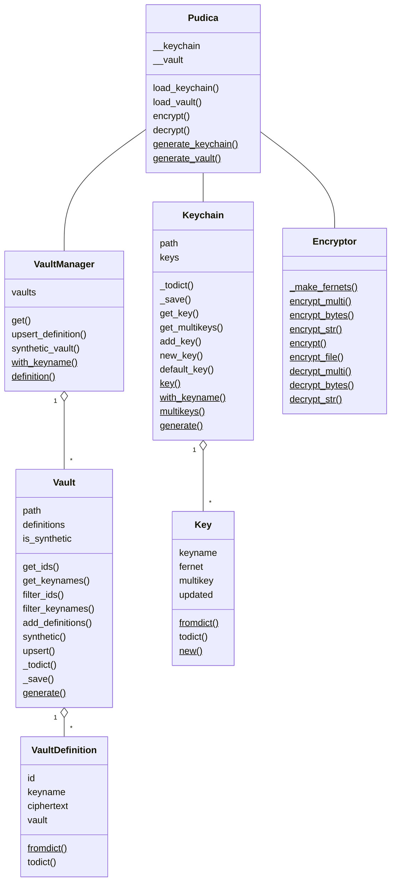

```mermaid
classDiagram
      class Keychain{
        path
        keys
        _todict()
        _save()
        get_key()
        get_multikeys()
        add_key()
        new_key()
        default_key()
        key()$
        with_keyname()$
        multikeys()$
        generate()$
      }
      class VaultManager{
        vaults
        get()
        upsert_definition()
        synthetic_vault()
        with_keyname()$
        definition()$
      }
      class Vault{
        path
        definitions
        is_synthetic
        get_ids()
        get_keynames()
        filter_ids()
        filter_keynames()
        add_definitions()
        synthetic()
        upsert()
        _todict()
        _save()
        generate()$
      }
      class Encryptor{
        _make_fernets()$
        encrypt_multi()$
        encrypt_bytes()$
        encrypt_str()$
        encrypt()$
        encrypt_file()$
        decrypt_multi()$
        decrypt_bytes()$
        decrypt_str()$
      }
      class Pudica{
        __keychain
        __vault
        load_keychain()
        load_vault()
        encrypt()
        decrypt()
        generate_keychain()$
        generate_vault()$
      }
      class VaultDefinition{
        id
        keyname
        ciphertext
        vault
        fromdict()$
        todict()
      }
      class Key{
        keyname
        fernet
        multikey
        updated
        fromdict()$
        todict()
        new()$
      }
      Keychain "1" o-- "*" Key
      VaultManager "1" o-- "*" Vault
      Vault "1" o-- "*" VaultDefinition
      Pudica -- Keychain
      Pudica -- Encryptor
      Pudica -- VaultManager
```