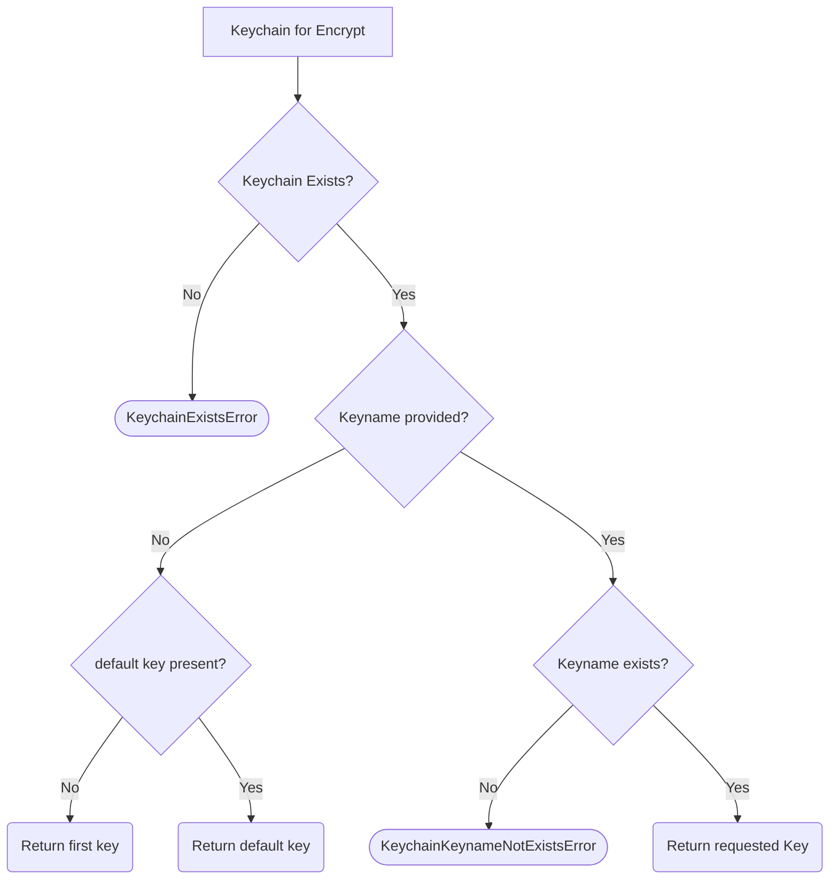
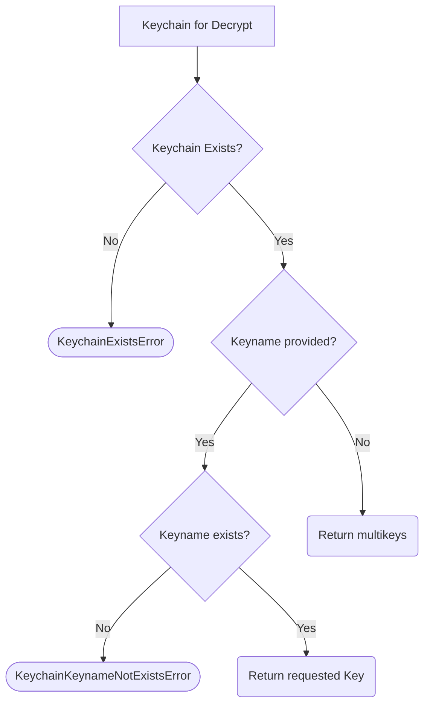
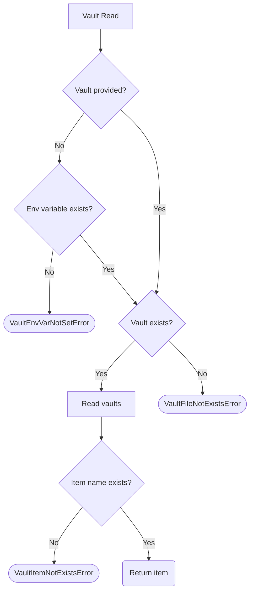
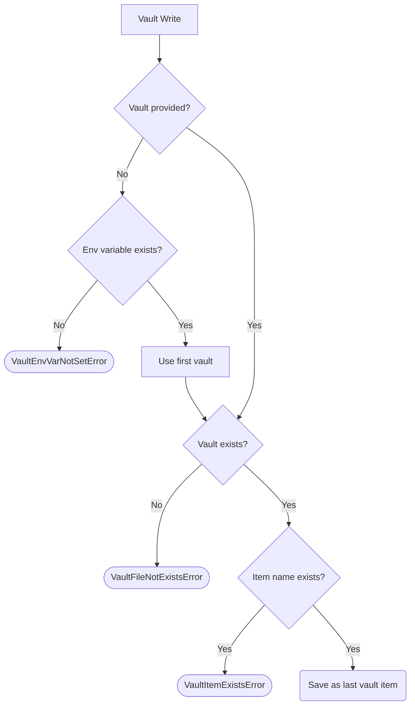

```mermaid
graph TD
    A[Keychain for Encrypt]
    B{Keychain Exists?}
    C([KeychainExistsError])
    D{Keyname provided?}
    E{Keyname exists?}
    F([KeychainKeynameNotExistsError])
    G(Return requested Key)
    H{default key present?}
    I(Return first key)
    J(Return default key)
    A --> B
    B -->|No| C
    B -->|Yes| D
    D -->|No| H
    H -->|No| I
    H -->|Yes| J
    D -->|Yes| E
    E -->|No| F
    E -->|Yes| G
```

```mermaid
graph TD
    A[Keychain for Decrypt]
    B{Keychain Exists?}
    C([KeychainExistsError])
    D{Keyname provided?}
    E{Keyname exists?}
    F([KeychainKeynameNotExistsError])
    G(Return requested Key)
    H(Return multikeys)

    A --> B
    B -->|No| C
    B -->|Yes| D
    D -->|No| H
    D -->|Yes| E
    E -->|No| F
    E -->|Yes| G
```

```mermaid
graph TD
    A[Vault Read]
    B{Vault provided?}
    C{Env variable exists?}
    D([VaultEnvVarNotSetError])
    E[Read vaults]
    F{Vault exists?}
    G([VaultFileNotExistsError])
    H{Item name exists?}
    I([VaultItemNotExistsError])
    J(Return item)

    A --> B
    B -->|No| C
    C -->|No| D
    C -->|Yes| F
    B -->|Yes| F
    F -->|No| G
    F -->|Yes| E
    E --> H
    H -->|No| I
    H -->|Yes| J
    
```

```mermaid
graph TD
    A[Vault Write]
    B{Vault provided?}
    C{Env variable exists?}
    D([VaultEnvVarNotSetError])
    E[Use first vault]
    F{Vault exists?}
    G([VaultFileNotExistsError])
    H{Item name exists?}
    I([VaultItemExistsError])
    J(Save as last vault item)

    A --> B
    B -->|No| C
    C -->|No| D
    C -->|Yes| E
    B -->|Yes| F
    F -->|No| G
    F -->|Yes| H
    E --> F
    H -->|Yes| I
    H -->|Yes| J
    
```